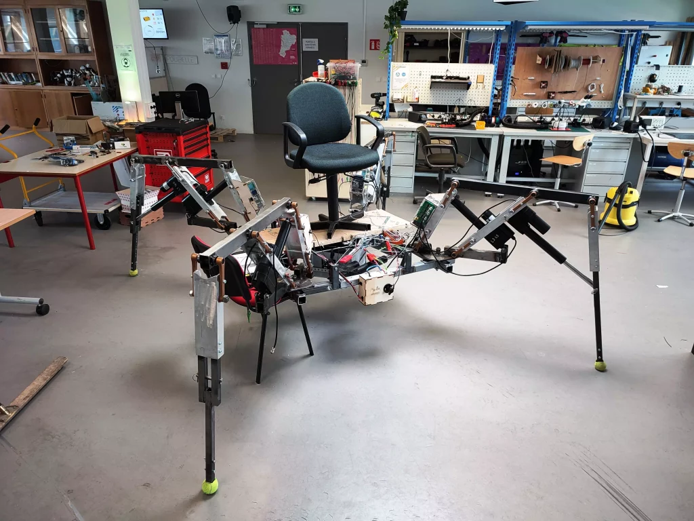

# MEGABOT

**Description:**
The Megabot is a large-scale quadruped robot capable of carrying a passenger, primarily intended for presentation at robotics-related events. It weighs approximately 250 kg (550 lbs), spans about 2.50 m (8.2 ft) in width, and is powered by electric actuators. Its design and construction were carried out by Julien Allali, a lecturer at ENSEIRB-MATMECA, and it is currently housed at the Bordeaux INP Fablab.



[📖 Sources documentation](src/README.md) • [📈 Project report](docs/report/Megabot_StateOfArt.pdf) • [📚 Bibliography](docs/bibliography)

## 📄 Project Summary
This project began in 2015, and thus, the design and hardware assembly phases are largely complete.
However, the entire control system and movement of the robot remain to be developed.
Therefore, the Megabot project (2023-2024) has set a goal to implement the software part to move the robot in a stable and smooth manner.

The problems encountered during this project have guided the choice of approach and movement algorithms.
Notably, the objective of moving a passenger on the robot has guided the choice of walking gait towards the most **stable** one, thus sacrificing speed.
Also, the deformations of the Megabot induced by its weight, as well as its weight itself, require a more advanced design of the control law of the Megabot's controller.

The realization of this project first began with an extensive study of the literature to determine the most optimal walking gait: the **creeping gait**. This exploration led to the drafting of a [state of the art report](docs/report/Megabot_StateOfArt.pdf) whose sources are available in the [bibliography](docs/bibliography) folder.
This approach was then implemented in simulation with the Placo tool. Tests were also carried out in simulation to determine the Megabot's range of action:


The simulation was then connected to the Megabot's controller to visualize the simulation and the real movement in parallel. Due to the previously described weight issue, the real movement was performed one leg at a time with it raised off the ground (to eliminate the weight constraint):


More specifically, the positions of the actuators (their extension) are retrieved at each step of the simulation and sent to the Megabot's controller in a specific format.

## 🚀 Installation and Usage Manual

- **Installation Instructions**:
  - [Placo](https://github.com/Rhoban/placo): It is recommended to read the documentation for installation, however, you can also simply use the command ```pip install placo==0.4.8``` for a quick installation.
- **Usage Instructions**:
  - Navigate to the folder:
    - [simulation](src/simulation/) if you wish to execute the pure simulation scripts.
    - [simulation_and_real_megabot](src/simulation_and_real_megabot) if you wish to execute the simulation script and send commands to the Megabot.
    - [Verin22](src/simulation_and_real_megabot/Verin22/) and [Verin23](src/simulation_and_real_megabot/Verin23/) if you wish to execute the displaying scripts speed caracterisation of the cylinders of the Megabot and the scripts to execute will be ```vitesses_22.py``` and ```vitesses_23.py```.
  - Use the command ```python <script_name>.py``` to execute one of the python scripts.

## 🔍 About this project

|       |        |
|:----------------------------:|:-----------------------------------------------------------------------:|
| 💼 **Client**                |  EIRLAB / Rhoban                                              |
| 🔒 **Confidentiality**       | **Public**                                         |
| ⚖️ **License**               |  [MIT License](https://choosealicense.com/licenses/mit/)                  |
| 👨‍👨‍👦 **Authors**               |   Floris JOUSSELIN & Mathilde POMMIER   |
